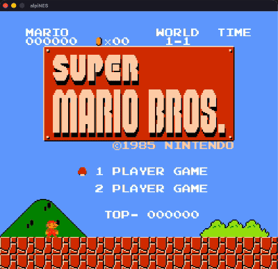
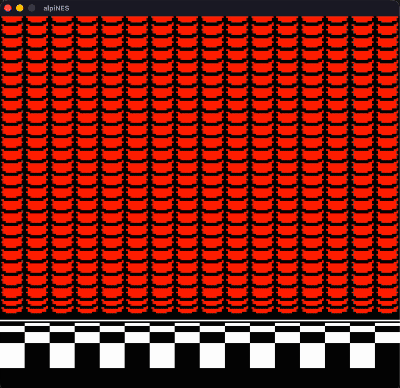
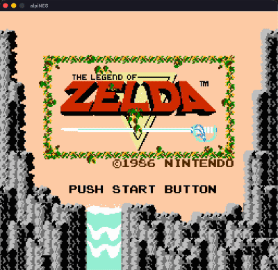
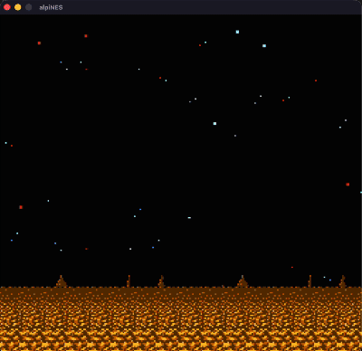
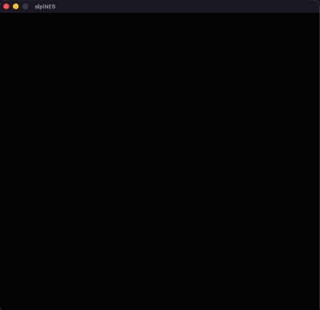
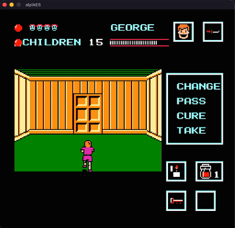

# NEStea

NEStea is a cycle-accurate emulator written in rust, capable of running over 70% of the NES library.

  

Features:

- Save states
- Turbo buttons
- Fast-forward & pause
- Post-processing shaders
- Audio support
- Support for mappers 0, 1, 2, 3, 4, and 66
- ...and a few more surprises (okay, maybe not that many)

### Some of my Favorites to Emulate

These games have a special place in my heart.

  
  
  
  

### Future Work

  

Not all games run the same on NEStea; most work flawlessly, some have minor glitches, and a few don't run at all. 

NES emulation is tricky and technical details can be obscure for particular titles. In fact, the NESdev wiki even has a dedicated page for [tricky-to-emulate games](https://www.nesdev.org/wiki/Tricky-to-emulate_games). In the future, it would be interesting to explore the quirks of the NES architecture. For now, I’m just happy to have the classics working.
